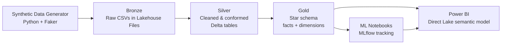

# Fabric Construction Analytics

An end-to-end analytics and machine-learning solution built on **Microsoft Fabric**, using a synthetic dataset modeled on a large national commercial construction company (**Meridian Construction Group**, a fictional firm). The project takes deliberately messy, multi-table source data from raw landing through a medallion (bronze → silver → gold) architecture and into trained ML models, surfaced in a Power BI report over a Direct Lake semantic model.

> **Note on the data:** every record here is synthetic, generated programmatically with intentional data-quality issues. No real company data is used. "Meridian Construction Group" is invented for demonstration purposes.

---

## About Meridian Construction Group (fictional)

**Meridian Construction Group** is a fictional large national commercial builder created to give this project a realistic operational context. It is not a real company, and any resemblance to an actual firm is coincidental. The profile below simply defines the "shape" of the business so the synthetic data and the analytics built on it hang together.

Meridian is modeled as a **general contractor / construction manager** operating across the United States, delivering large commercial and institutional projects. Its profile:

- **Delivery models:** primarily CM at Risk and Design-Build, with some Design-Bid-Build, IPD, and CM Agency work — the mix a modern national builder actually runs.
- **Verticals:** healthcare, commercial, higher education, K-12, government/civic, aviation, data centers, mission-critical, industrial, and sports & entertainment facilities.
- **Geographic footprint:** regional offices across metros including Kansas City, Denver, Dallas, Houston, Atlanta, Phoenix, Portland, Nashville, Minneapolis, Omaha, Austin, and Charlotte.
- **Operations captured in the data:** project portfolios with budgets and schedules, cost tracking by CSI MasterFormat division, subcontractor prequalification and bidding, field labor and timesheets, and jobsite safety reporting.

This profile is what the generator encodes: every project, cost line, bid, timesheet, and safety incident in the dataset is a plausible artifact of a company that looks like Meridian. The point is not the fiction itself but that it produces **domain-realistic, messy, interrelated data** — the kind a real construction company's systems generate — so the medallion pipeline and ML models have something genuine to work on.

---

## Why this project

Construction analytics is a domain where the data is genuinely messy — inconsistent cost coding, schedule slippage, duplicate vendor records, sparse safety logs — and where the business questions (Will this project run over budget? Which jobs are slipping? Where is safety risk concentrated?) map cleanly onto ML. This repo demonstrates the full lifecycle on Fabric: ingestion, medallion transformation, dimensional modeling, experiment-tracked ML, and reporting.

---

## Architecture



| Layer | What lives here | Form |
|-------|-----------------|------|
| **Bronze** | Raw generated data, landed exactly as produced — messy dates, dupes, dirty names | CSV in Lakehouse `Files/` |
| **Silver** | Parsed, deduplicated, type-enforced, entity-resolved; lineage-stamped (`batch_id`, `ingested_at`, `data_split`) | Managed Delta tables |
| **Gold** | Dimensional star schema (dimensions + facts, deterministic surrogate keys) plus a model-ready training table | Managed Delta tables |
| **ML** | Cost-overrun regression, tracked and registered with MLflow | Fabric notebook |
| **Reporting** | KPIs and model output over a Direct Lake semantic model | Power BI report |

An **incremental ingest** path adds new batches to silver on demand — self-detecting the next batch number from the Lakehouse, stamping each batch as held-out `test` data, and appending idempotently (create-or-append with a key-based dedup safety net).

---

## Data model

Seven interrelated source tables represent a construction company's operational footprint:

| Table | Grain | Notable fields | Feeds |
|-------|-------|----------------|-------|
| `projects` | one row per project | type, region, delivery method, contract value, planned vs actual dates | delay analysis |
| `cost_line_items` | project × CSI division | budget vs actual, change orders | **cost-overrun model** |
| `schedule_tasks` | project × task | planned vs actual duration, predecessors | **delay model** |
| `labor_timesheets` | crew-day | trade, regular/OT hours, rate | labor cost rollups |
| `subcontractors` | one row per sub | trade focus, rating, prequalification | vendor analysis |
| `sub_bids` | project × division × bidder | bid amount, awarded flag | bid competitiveness |
| `safety_incidents` | one row per incident | type, severity, root cause, lost days | **safety classifier** |

Cost is coded by **CSI MasterFormat division** (03 Concrete, 23 HVAC, 26 Electrical, …), the standard language of construction estimating.

---

## The mess (and why it's intentional)

Bronze data faithfully preserves the kind of problems real source systems produce, so the silver layer has something real to solve:

- **Inconsistent date formats** across every date column (`2024-06-19`, `08-Aug-2025`, `06/19/24`), plus a few impossible dates
- **Missing values** scattered through nullable fields
- **Duplicate records** — both exact-duplicate project rows and vendors entered under variant spellings (`Sawyer Group LLC` / `SAWYER GROUP L.L.C.` / `  sawyer group llc `)
- **Negative and zero costs**, contract-value outliers
- **Inconsistent categoricals** (`Y` / `Yes` / `TRUE` for the same boolean)

The silver notebook is where this gets resolved — date parsing, deduplication, fuzzy vendor entity-resolution, type enforcement, and range validation.

---

## Engineered signal (modeling on synthetic data, honestly)

Random synthetic data has no real relationships for a model to learn, so the generator deliberately encodes **documented causal relationships** into project outcomes. This makes the ML meaningful: the model can be validated by confirming it recovers the relationships that were built in.

The engineered ground truth:

- **Cost overrun** rises with change-order volume, Design-Bid-Build delivery (least owner control), complex project types (data center, mission-critical, healthcare), and MEP-heavy CSI divisions (HVAC, electrical, plumbing); it falls with better subcontractor ratings.
- **Schedule delay** rises with winter starts, project complexity, and Design-Bid-Build delivery.
- **Safety incidents** rise with overtime intensity and project size; severity skews toward certain trades (ironworkers, operators).

All relationships are parameterized and applied with bounded noise, so the signal is learnable but not trivially perfect. The trained model recovers them: **delivery method and change-order ratio rank as the top features**, and mean overrun by delivery method reproduces the engineered ordering (Design-Bid-Build highest → IPD lowest). This "recover the known signal" approach is how the modeling methodology is validated despite the data being synthetic.

---

## Data engineering notes

A few deliberate design choices worth calling out:

- **Deterministic surrogate keys.** Gold dimensions use `row_number()` over an ordered window (materialized before joins), *not* `monotonically_increasing_id()` — the latter can be recomputed by Spark and silently corrupt fact-to-dimension joins.
- **Referential integrity is validated, not enforced.** A Lakehouse doesn't enforce foreign keys, so gold includes an explicit orphan-check step confirming every fact row resolves to its dimensions. Relationships are then declared in the Power BI semantic model.
- **Provenance-based train/test split.** Lineage columns (`batch_id`, `data_split`) let the model train on the original load and evaluate on later-ingested batches — a held-out set defined by *when data arrived*, closer to real deployment than a random shuffle.
- **Idempotent incremental loads.** The incremental notebook is safe to re-run: create-or-append plus key-based dedup means a repeated batch can't create duplicates.

---

## Repository structure

```
fabric-construction-analytics/
├── README.md
├── requirements.txt                       # local dev dependencies (not used by Fabric)
├── data_generation/
│   └── generate_construction_data.py      # parameterized generator, with engineered signal
├── notebooks/
│   ├── 01_bronze_ingest.ipynb             # generate + land raw messy CSVs (bronze)
│   ├── 02_silver_cleanup.ipynb            # clean, dedupe, entity-resolve, lineage-stamp → Delta
│   ├── 03_incremental_ingest.ipynb        # add new batches to silver (self-detecting, idempotent)
│   ├── 04_gold_star_schema.ipynb          # dimensions + facts + RI check + ML training table
│   └── 05_cost_overrun_model.ipynb        # MLflow-tracked, registered regression model
├── docs/
│   └── architecture.md                    # detailed design notes
└── .gitignore
```

---

## Machine learning

The built and validated model is **cost-overrun regression**, predicting `overrun_ratio` (actual ÷ budget) at the cost-line-item grain:

| Aspect | Detail |
|--------|--------|
| Model | Gradient-boosted regression (scikit-learn) |
| Target | `overrun_ratio` = actual ÷ budget |
| Features | project type, delivery method, region, CSI division, division group, change-order ratio, winter-start flag |
| Evaluation | held-out test set (provenance-based when an incremental batch exists, else random 75/25) |
| Result | **R² ≈ 0.60** on held-out data; top features are delivery method and change-order ratio — recovering the engineered signal |
| Tracking | MLflow run logs params, metrics, and the model; registered as `construction_cost_overrun` |

Training runs in a Fabric notebook with **MLflow** experiment tracking (native to Fabric) — parameters, metrics, and artifacts logged per run, with the model registered for scoring.

**Future scope** (the data supports these; models not yet built): a **project-delay classifier** (on-time vs delayed, using the engineered winter-start / complexity / delivery signal) and a **safety-risk model** (incident likelihood by project, using overtime and project attributes). The safety data is thin at the current scale, so that model is noted as a methodology demonstration rather than a production classifier.

---

## Reproducing this

### Local (outside Fabric)

The dataset is fully reproducible — no data files need to be committed. Use a virtual environment:

```bash
python -m venv .venv
source .venv/bin/activate        # Windows: .venv\Scripts\activate
pip install -r requirements.txt

python data_generation/generate_construction_data.py --projects 120 --seed 42 --outdir ./construction_raw
```

Adjust `--projects` to scale volume and `--seed` for a fresh variant of the mess.

### Running the pipeline in Fabric

Notebooks run in order: `01` (bronze) → `02` (silver) → `04` (gold) → `05` (model). `03` (incremental) is run on demand to add a test batch, after which `04` and `05` are re-run to refresh gold and retrain. Each layer is a batch step — new data reaches gold only when gold is re-run. In production this would be orchestrated with a **Fabric Data Pipeline** (scheduled, or triggered when new files land in bronze) rather than run by hand.

### Inside Fabric

Fabric's Spark runtime already includes pandas, numpy, and scikit-learn, so `requirements.txt` is **not** consumed there. The only extra package the generator needs is Faker, which the bronze notebook installs in-session with `%pip install faker` (or you can attach a workspace **Environment** with Faker added). Point the generator's output at the Lakehouse to land data directly:

```python
OUTDIR = "/lakehouse/default/Files/bronze/construction_raw"
```

> `requirements.txt` in this repo is for **local development and reproducibility**, not for Fabric dependency management — Fabric handles its own runtime packages.

---

## Tech stack

- **Microsoft Fabric** — Lakehouse, notebooks, Spark, Delta, Direct Lake
- **MLflow** — experiment tracking and model registry (native in Fabric)
- **Power BI** — Direct Lake semantic model and report
- **Python** — PySpark, pandas, scikit-learn, Faker
- **Git** — Fabric ↔ GitHub native integration for workspace ALM
