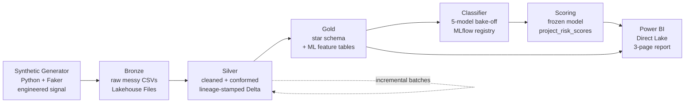

# Fabric Construction Analytics

An end-to-end analytics and machine-learning project built on **Microsoft Fabric**, using a synthetic dataset modeled on a large national commercial construction company (**Meridian Construction Group**, fictional). Deliberately messy, multi-table source data flows through a medallion (bronze → silver → gold) architecture into a calibrated over-cost risk classifier, surfaced in a three-page Power BI report over a Direct Lake semantic model.

📊 **[View the full dashboard (PDF)](docs/Meridian%20Portfolio.pdf)**

> **Note on the data:** every record is synthetic, generated programmatically with intentional data-quality issues and documented, engineered relationships. No real company data is used. "Meridian Construction Group" is invented for demonstration. Dollar magnitudes are illustrative; the *relationships* between variables are what's engineered and modeled.

---

## About Meridian Construction Group (fictional)

Meridian is a fictional national general contractor / construction manager, created to give the project realistic operational context. Modeled profile:

- **Delivery models:** CM at Risk, Design-Build, Design-Bid-Build, IPD, CM Agency
- **Verticals:** healthcare, commercial, higher education, K-12, government/civic, aviation, data centers, mission-critical, industrial, sports & entertainment
- **Geographic footprint:** offices across Kansas City, Denver, Dallas, Houston, Atlanta, Phoenix, Portland, Nashville, Minneapolis, Omaha, Austin, Charlotte
- **Operations captured:** project portfolios, cost tracking by CSI MasterFormat division, subcontractor prequalification and bidding, field labor/timesheets, jobsite safety

The generator encodes this profile so the pipeline and model work on domain-realistic, messy, interrelated data.

---

## What this project demonstrates

- A full **medallion pipeline** on Fabric: ingestion, cleaning, dimensional modeling, incremental loads
- **Data-quality engineering**: multi-format date parsing, deduplication, vendor entity-resolution, range validation
- **ML with discipline**: leakage-safe feature engineering, a multi-model bake-off with cross-validation, calibrated probabilities, MLflow tracking and model registry, frozen-model scoring of unseen data
- **A decision-support dashboard**: historical portfolio, current status, and a model-driven risk view over Direct Lake

---

## Architecture



| Layer | Contents | Form |
|-------|----------|------|
| **Bronze** | Raw generated data, landed as-is — messy dates, dupes, dirty vendor names | CSV in Lakehouse `Files/` |
| **Silver** | Parsed, deduplicated, entity-resolved, type-enforced; lineage columns (`batch_id`, `ingested_at`, `data_split`) | Managed Delta |
| **Gold** | Star schema (dimensions + facts, deterministic surrogate keys) + model-ready feature tables | Managed Delta |
| **ML** | Over-cost risk classifier, cross-validated bake-off, registered model | Fabric notebook + MLflow |
| **Scoring** | Frozen-model inference → `project_risk_scores` (probabilities + risk bands) | Managed Delta |
| **Reporting** | 3-page dashboard over a Direct Lake semantic model | Power BI |

📄 For the design rationale behind each layer — surrogate keys, leakage discipline, model selection, and the bugs caught along the way — see **[docs/architecture.md](docs/architecture.md)**.

---

## Pipeline notebooks

Run in order: `01 → 02 → 04 → 05 → 06 → 07`. `03` (incremental) runs on demand to add a batch, after which `04 → 05 → 07` refresh.

| Notebook | Role |
|----------|------|
| `01_bronze_ingest` | Generate signal-bearing messy data, land raw CSVs (bronze) |
| `02_silver_cleanup` | Clean, dedupe, entity-resolve, lineage-stamp → Delta |
| `03_incremental_ingest` | Add a new batch to silver — self-detects next batch number, idempotent append |
| `04_gold_star_schema` | Dimensions + facts + referential-integrity check + `ml_cost_training` |
| `05_gold_project_classification` | Project-grain, leakage-safe feature table with binary over-cost label |
| `06_overrun_classifier` | 5-model bake-off (LR, NB, RF, GBM, SVM), cross-validated, MLflow, register winner |
| `07_score_projects` | Load registered model, score projects (no retraining) → `project_risk_scores` |

---

## The data model

Seven source tables represent the operational footprint: `projects`, `cost_line_items` (by CSI division), `schedule_tasks`, `labor_timesheets`, `subcontractors`, `sub_bids`, `safety_incidents`. Cost is coded by **CSI MasterFormat division** (03 Concrete, 23 HVAC, 26 Electrical, …).

Gold reshapes these into a **star schema**: `dim_project`, `dim_date`, `dim_vendor`, `dim_division`, and fact tables `fact_cost`, `fact_labor`, `fact_safety`, `fact_schedule`.

---

## The mess (intentional)

Bronze preserves the problems real source systems produce, so silver has real work to do:

- **Inconsistent date formats** across every date column, plus injected impossible dates (year 1, year 2099)
- **Missing values** through nullable fields
- **Duplicate records** — exact-duplicate project rows and vendors under variant spellings (`Sawyer Group LLC` / `SAWYER GROUP L.L.C.` / `  sawyer group llc `)
- **Negative and zero costs**, contract-value outliers
- **Inconsistent categoricals** (`Y` / `Yes` / `TRUE`)

Silver resolves these: multi-format date parsing with range-bounding (implausible dates → null), deduplication, fuzzy vendor entity-resolution via a normalized match key, boolean normalization, and type enforcement.

---

## Engineered signal (modeling on synthetic data, honestly)

Random synthetic data has no relationships to learn, so the generator encodes **documented causal relationships**, and the model is validated by confirming it recovers them:

- **Cost overrun** rises with change-order volume, Design-Bid-Build delivery, complex project types (data center, mission-critical, healthcare), and MEP-heavy CSI divisions; falls with better subcontractor ratings.
- **Schedule delay** rises with winter starts, complexity, and Design-Bid-Build.
- **Safety incidents** rise with overtime intensity and project size.

The model recovers these: mean overrun by delivery method reproduces the engineered ordering (Design-Bid-Build highest → IPD lowest), and it's the top feature. This "recover the known signal" approach validates the methodology despite the data being synthetic.

---

## Machine learning: over-cost risk classification

**Problem framing.** Rather than predict *how much* a project will overrun (false precision on synthetic data), the model predicts the **probability a project overruns** at kickoff — a binary classifier producing a calibrated risk score, which is what a decision-support tool actually needs.

**Target.** `is_overrun` = project-level `actual ÷ budget > 1.18`. The threshold sits near the project-grain median, so "over-cost" means "worse than a typical project" and the class balance is natural — no resampling, which keeps predicted probabilities calibrated.

**Leakage discipline.** Features use only what's known at project **start**: project type, delivery method, region, contract value, square footage, planned duration, winter-start flag, MEP budget share. No actuals, no realized durations — nothing that only exists once the project runs.

**Bake-off.** Five classifiers compared under one preprocessing pipeline with 5-fold stratified cross-validation: logistic regression, Naive Bayes, random forest, gradient boosting, SVM. They performed comparably (CV-AUC ≈ 0.82–0.86). **Logistic regression was selected** — its CV edge was within one standard deviation of the nominal winner, but it had the best held-out AUC, the best calibration (lowest Brier), and interpretable odds ratios. For a risk score a PM must trust, interpretability + calibration outweigh a noise-level accuracy difference.

**Interpretability.** Odds ratios recover the engineered drivers — e.g. CM Agency and Design-Bid-Build carry several times the odds of over-cost versus IPD; Mission Critical elevated. Numbers you can explain to a project manager.

**Validation on unseen data.** Lineage columns enable a **provenance-based split**: the model trains on the original load and is evaluated on later-ingested batches (genuinely unseen projects), not a random shuffle. Training and scoring are separate notebooks — scoring loads the *registered, frozen* model rather than retraining — so new batches are a true holdout and probabilities stay comparable across batches.

**Calibration (the payoff).** Risk bands map cleanly to actual outcomes:

| Risk band | Actual overrun rate |
|-----------|---------------------|
| Low | ~14% |
| Medium | ~53% |
| High | ~89% |

When the model says "High risk," ~89% of those projects actually overran — a trustworthy, actionable score.

---

## Dashboard (Power BI, Direct Lake)

Three pages over the gold semantic model — see **[docs/dashboard.pdf](docs/dashboard.pdf)**:

1. **Historical Portfolio** — KPIs, overrun by project type and delivery method (the engineered signal, visible), regional breakdown, project detail.
2. **Current Project Status** — active-project budget burn, schedule progress, operational view.
3. **Over-Cost Risk Analysis** — risk-band distribution, the calibration chart (actual overrun rate climbing with risk band), predicted-vs-actual scatter, and a flagged high-risk project list. A `status` slicer switches between validating on completed projects and assessing risk on active ones.

---

## Data engineering notes

- **Deterministic surrogate keys.** Gold dimensions use `row_number()` over an ordered window (materialized before joins), not `monotonically_increasing_id()` — the latter can be recomputed by Spark and silently corrupt fact-to-dimension joins.
- **Referential integrity validated, not enforced.** A Lakehouse doesn't enforce foreign keys, so gold includes an explicit orphan-check; relationships are then declared in the semantic model.
- **Idempotent incremental loads.** The incremental notebook is safe to re-run — create-or-append plus key-based dedup.
- **Provenance-based evaluation.** Train/test membership is stamped at ingest (`data_split`) and durable across rebuilds, keyed to immutable `batch_id`.

---

## Reproducing this

The whole pipeline runs inside Fabric — data generation lives in `01_bronze_ingest`, so there's no separate generation step. Attach a Lakehouse and run the notebooks in order (`01 → 02 → 04 → 05 → 06 → 07`; `03` on demand to add a batch).

Fabric's Spark runtime already includes pandas, numpy, scikit-learn, and MLflow, so the only extra dependency is Faker, which the bronze notebook installs in-session with `%pip install faker`.

Each medallion layer is a batch step — new data reaches gold only when gold is re-run; in production this would be orchestrated with a **Fabric Data Pipeline** (scheduled or triggered on new bronze files).

---

## Repository structure

```
fabric-construction-analytics/
├── README.md
├── notebooks/
│   ├── 01_bronze_ingest.ipynb
│   ├── 02_silver_cleanup.ipynb
│   ├── 03_incremental_ingest.ipynb
│   ├── 04_gold_star_schema.ipynb
│   ├── 05_gold_project_classification.ipynb
│   ├── 06_overrun_classifier.ipynb
│   └── 07_score_projects.ipynb
├── powerbi/
│   └── construction_analytics.pbix
├── docs/
│   ├── dashboard.pdf
│   └── architecture.md
└── .gitignore
```

---

## Tech stack

- **Microsoft Fabric** — Lakehouse, notebooks, Spark, Delta, Direct Lake
- **MLflow** — experiment tracking and model registry (native in Fabric)
- **Power BI** — Direct Lake semantic model and report
- **Python** — PySpark, pandas, scikit-learn, Faker
